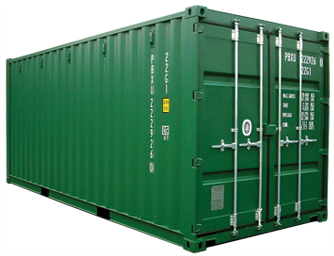
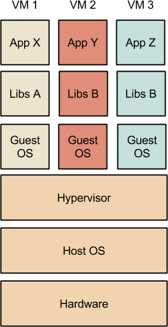
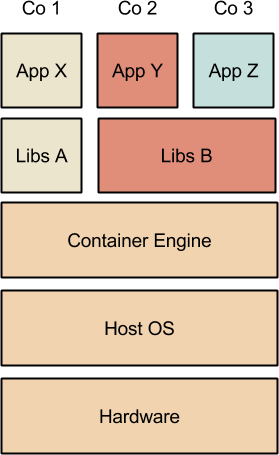
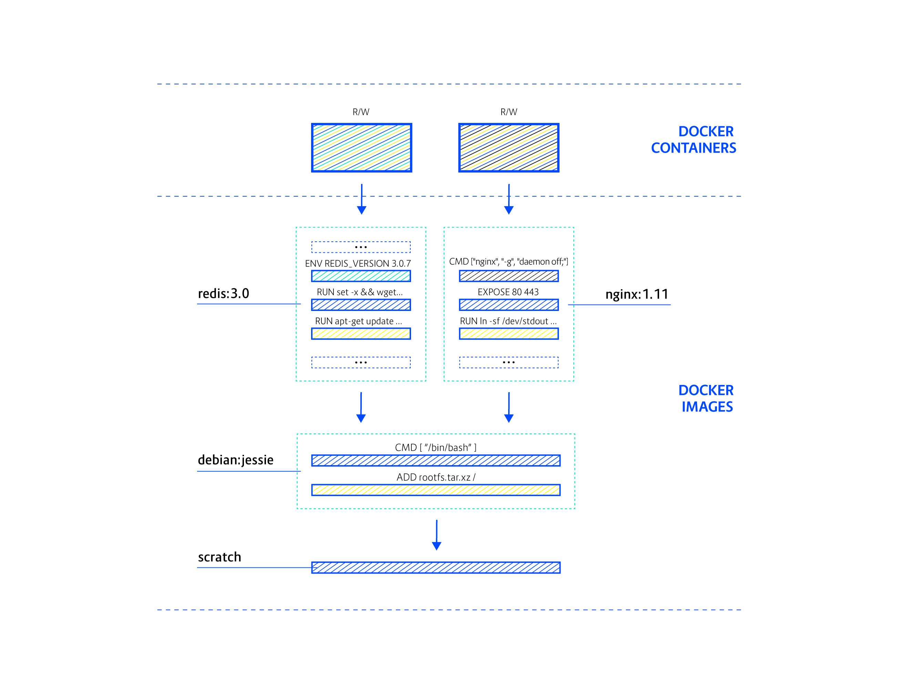
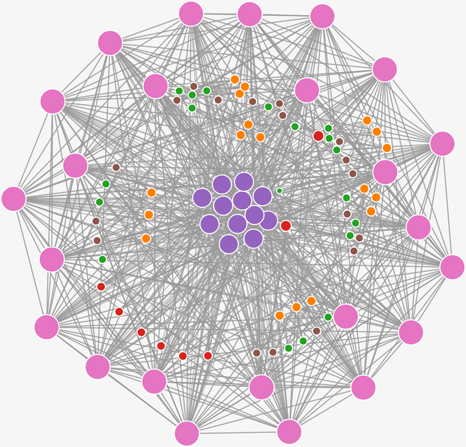

## Docker Essentials

---

## Overview

You should leave here knowing:

 - What Docker is
 - Why it's so popular
 - The major use cases
 - The basics of
    - how it works
    - how to use it
      - building images
      - using Docker registries
      - volumes (persistence)
      - deploying systems

---

## Prerequisites

 - Basic Linux knowledge
   - We will not cover Windows containers
     - but you can use the Docker Toolbox on Windows
 - A laptop with Docker installed
   - OR -
 - A web browser and wifi access
   -  https://play-with-docker.com

---

## So what is it?

A Docker container is a _portable_ store for a _single component_ and its _dependencies_



---

## Isn't this just a lightweight VM?

 - Both provide _isolated environments_
 - Large overlap in use cases

---

## Not quite

 - No virtualisation
 - Docker is much more efficient
   - Boots in under a second
   - Much smaller image size
 - Developer oriented interface

---

## The Shipping Metaphor

 - Goods come in a variety of shapes and sizes
   - sacks of coffee, drums of oil, boxes of electronics...
   - each of different shapes, sizes and requirements
 - Historically, shipping was a manual process
   - Dock workers needed to unload and load ships

---

## The Intermodal Container

 - Introduced ~1950s.
 - Standard size 
 - Can be moved between transit points with minimal effort
   - infrastructure designed around containers
     - trucks, fork-lifts, cranes, trains
 - Led to enormous savings in time and effort


---

## IT Diversity

 - No longer are systems simple LAMP stacks
 - Composed of multiple components
   - Javascript frameworks
   - NoSQL databases
   - Message Queues
   - REST APIs
   - Backend servers

---

#### All of which must run on a variety of environments
   - Developer's laptops
   - In-house testing cluster
   - Production VMs in the cloud

---

#### Changes between environments cause problems
 - Different libraries, operating systems, configuration
 - Things break unexpectedly
 - Hard to test everything with everything
 - Continuous manual effort

---

### Enter the Docker container!
 - Contains dependencies down to the OS
 - Will work the same on each environment
 - Lightweight enough to be easily moved between environments

---

## First Steps Exercise

 - Quick play with Docker to see what it looks like
 - Open the "First Steps" Worksheet

---

 - Should now have a rough feel for Docker
 - Get the idea that it encapsulates an application
 - Fast to get started

---

## Docker CLI

 - has "evolved" over time 
 - high level management commands
   - container, image, volume, network...
 - some commands duplicated
   - `docker ps == docker container ls`
   - `docker rmi == docker image rm`
 - `--help` gives info on commands and subcommands

---

## A Closer Look

 - `docker run -it debian bash`
   - same as `docker container run` ...
 - `run` is the command
 - arguments `-i` and `-t` provide interactive terminal
 - `debian` is the image name
 - `bash` is the command to run inside the container

---

<!-- client server architecture -->

## Behind the scenes

 &nbsp;


---

## Client Server Architecture


---

 - Daemon starts and manages containers
 - Client connects to daemon over HTTP
 - Client runs natively on Linux, Mac, Windows
 - Server is Linux only 

---

## Docker Images

 - Like a stopped VM
 - In OO programming terms:
   - image == class
   - container == instance

---



---

## Docker Hub

 - Repository for images
 - Distros
   - Centos, Debian, Alpine...
 - Languages
   - Go, Java, C...
 - Applications
   - Redis, Wordpress, RevealJS...

---

## Creating an Image Exercise

 - Let's see how we can make our own images
 - Open the "Building an Image with Commit" exercise


---

## Problems

 - That was great, *but*:
   - it's not easily repeatable
   - have to manually re-run all steps to make changes
     - e.g. update software, tweak configuration

---

## Dockerfiles

 - The solution is to use a *Dockerfile*
 - List of repeatable steps for creating an image


---

## Dockerfile in Action

 - Let's see how we can use a Dockerfile to create our image
 - Open the "Building an Image using a Dockerfile" exercise

---

## Caching & Docker Builds

 - Each line in a Dockerfile corresponds to a layer in the image

```
Sending build context to Docker daemon 217.7 MB
Step 1/5 : FROM debian
 ---> 7b0a06c805e8
Step 2/5 : RUN apt-get update
 ---> Using cache
 ---> 5ea99a5cc9bf
Step 3/5 : RUN apt-get install -y cowsay fortune
 ---> Using cache
 ---> b67bb99b4bbd
Step 4/5 : ENTRYPOINT /usr/games/cowsay
 ---> Running in 16028c610757
 ---> 4bb4f3028e8c
Removing intermediate container 16028c610757
Step 5/5 : CMD Moo to you
 ---> Running in 377e166c1138
 ---> 7c93004dce27
Removing intermediate container 377e166c1138
Successfully built 7c93004dce27
```

---

## Storing Docker Images

 - Docker images are stored in a *registry*
 - These can be local or remote


---


## Docker Hub

 - The Docker Hub is a large on-line registry of community images
   - where we got debian, nginx etc from
 - Provided by Docker Inc
 - Free of charge for public images
 - https://hub.docker.com/
 

---


## Image Namespaces

 - Names without a slash refer to "official" images 
    - `nginx`, `debian`, `alpine`, `redis`
    - curated by Docker and the community
 - Names with a single slash are user images on the Hub
    - `amouat/network-utils`
    - `drone/drone`
 - Names with a URL refer to a specific registry
    - `localhost:8000/myreg`
    - `quay.io/coreos/etcd` 


---

## Tags

 - To get a specific version of an image, use tags:
   - `docker pull debian:jessie`
   - `docker pull nginx:1.11` 
   - `docker pull drone/drone:0.5`
 - Generally a good idea to specify a tag
 - If no tag is specified, Docker will pull a tag called `latest` 
   - there is no magic here
   - it is not necessarily the most up-to-date image
   - may not exist

---

## Container Filesystems

 - Docker images are made up of layers
 - Each one directly corresponds to line in Dockerfile
 - When starting a container
   - Docker does not make a full copy of the image
   - Instead it tacks a r/w layer on top
   - which points to the r/o layers of the image below
   - changes are written to the r/w layer
   - File is copied up and "hides" the original
 - Enables very fast start-up
 

---

## Union Filesystem

 - Sometimes called the "Union Filesystem" (UFS)
   - Or CoW Filesystem
 - Not Docker tech
 - Multiple underlying implementations
   - Overlay, AUFS, ZFS, BTRFS, device mapper...

---

## Persisting Data

 - When a container is deleted, the files inside are lost
   - unless they live in a *volume*
 - Volumes are the primary way of handling state in Docker
 - A volume is a file or directory that lives outside the UFS
 - Volumes have native performance

---

## Creating Volumes

 - Multiple ways to create volumes:
   - with the `-v` flag to docker run
   - with the `docker volume create` subcommand
   - With the `VOLUME` statement in Dockerfiles

---

## Volume Management

 - Users can choose which folder on the host a volume maps to
   - or let Docker choose

---

## Volumes Exercise

 - Let's have a look at volumes in action
 - Open the Docker Volumes worksheet

---

## Docker and Databases

 - Easy to run in Docker
 - But also easy to lose data
 - Don't do it unless
   - you don't mind losing the data 
     - redis cache
   - or you know what you're doing
 - Instead use VM or service (RDS etc)

---

## Talking between containers

 - Networking is a big topic!
 - Don't have time to cover multi-host
 - But let's see how we can have two containers can communicate

---

## Docker Networks

 - Docker has a high-level concept of networks
 - Multiple drivers
   - default is `bridge`
 - Containers on the same network can talk to each other by name
   - Behind the scenes Docker runs a DNS server

---

## Networking Exercise

 - Let's take a quick look at networking
 - Open the network exercises sheet

---

## Compose

 - So far we've been using the Docker CLI
 - Gets unweildy 
   - lots of options
   - exacerbated when lots of containers

---

## Compose

 - Solution is to use Docker Compose
 - Basically YAML file for launching containers
 - Useful in development
 - Can also be used in production
   - particularly with Swarm mode

---

## Compose Exercise

 - Let's take a quick look at compose in action
 - Open the Compose worksheet

---

## A Complete Example

 - We've been playing with toy examples so far
 - A full example can be found at
  - https://github.com/microservices-demo/microservices-demo/blob/master/deploy/docker-compose/docker-compose.yml

---

## Docker Building Blocks

To get the most out of Docker, it's good to understand the features it builds
on.

---

## Linux Kernel Features

 - All containers share the kernel
   - And the host
 - Makes things fast and lightweight
 - A lot of Docker is simply exploiting Kernel features
 - Arguably less secure than VM

---

## cgroups
  
 - Control Groups
 - Groups tasks
 - Controls resources
   - Applies Limits 
   - Isolates
   - Accounts for 

---

## Namespaces

  - Process 
  - Filesystem
  - Network
  - Plus some others

---

## Capabilities

  - Limit what a container can do
  - Restrict kernel calls

---


# So why is Docker so popular?

---

## Containers aren't new

 - Jails, chroot, Solaris Zones, Virtuozzo
 - Borg
 - LXC

---

## First Container Tech

 - Glued together missing pieces
 - Fast and portable
 - Targetted developers

---

## Enabled New Workflow

<!-- image here would be good -->

 - Containers become unit of development
 - Shipped between dev, test and prod
 - Works the same everywhere
 - Contains dependencies and environment

---

## Not possible before
 
 - VMs too slow and clunky
 - Developer interface lacking

---

## Agility

 - Develop faster
 - Test faster
 - Deploy faster

---

## Reliability

 - Less breakages
 - Less sweat getting to production
 - Less dealing with multiple environments

---

<br/>

# What For?

---

## CI/CD Pipelines


 - Consistent environment
 - Deploy faster
 - Test faster
 - Make sure you ship what you test!

---

## Microservices

 - Small services that do one thing well
 - Loosely coupled
 - As opposed to monoliths
 - Scale-out as opposed to scale-up

---

## The Good

 - Can simplify software
 - Scale only needed services
 - Easier to change
 - Easier to distribute
 - Use best tool for the job

---

## The Bad

 - How to divide system into microservices?
 - Fast function calls become slow REST calls


---

## The Ugly

 - Complexity is moved to network



---

<!-- .slide: data-background="#000000" -->


---


## Immutable infrastructure

 - Golden images
 - Don't allow running containers to change
 - Instead replace with new containers 
 - Simpler, no need for CM

---

## The Future

 - Patterns & Best Practices<!-- .element: class="fragment" data-fragment-index="1" -->
   - Signals, logging, env vars, pods, sidecars, ambassadors...
   - Still being developed
 - Orchestration<!-- .element: class="fragment" data-fragment-index="2" -->
   - Battlefield!
   - Kubernetes, Mesos, Swarm?
 - Unikernels<!-- .element: class="fragment" data-fragment-index="3" -->
   - Huge potential
   - May overtake containers

---

## Conclusion

 - Docker Containers are
   - a _portable_ store for a _single component_ and its _dependencies_ 
 - Can provide
   - portability
   - agility
   - reliability
 - Enable a new development workflow
   - CI/CD with images as artifacts
   - immutable infra
   - microservices

